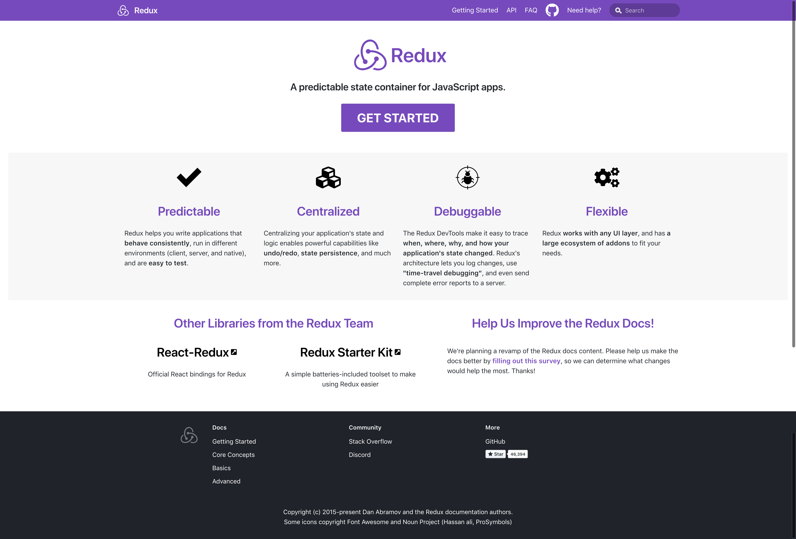

import { FullScreenCode } from "mdx-deck/layouts";
import { Horizontal } from "mdx-deck/layouts";

## 🌰 Using [Redux](https://redux.js.org/) with a UI

---


> Redux

> a predictable state container for JavaScript apps

```notes

10sec review of what Redux is

ok here's the official definition

```

---

<!-- 

<iframe src="https://redux.js.org/" width="1280" height="720" />
 -->

```notes
in case you haven't noticed
they have a new doc site powered by docusaurus
```

---

`store` API

- `store.getState()`
- `store.dispatch(action)`
- `store.subscribe(listener)`

```notes
here's the redux API that we never (really) use

mention here that a lot of work is done by react redux
```

---

### Naive Use of Redux with a UI

---

To use Redux with _any_ UI, we need to:

- get the `store` state
- get notified whenever the store state changes
- interact with the store

```notes
1 in order to render what the UI needs on the screen
2 so as to keep the UI updated
3 in case of redux, by dispatching actions to it
```

---

export default FullScreenCode;

```js
import { createStore } from "redux";

// assuming we've implemented a simple "counter" reducer
// this is just Redux
const store = createStore(counter);

// get store state
// document.getElementById("app").innerHTML = `counter: ${store.getState()}`;

function render() {
  document.getElementById("app").innerHTML = `counter: ${store.getState()}`;
}

// get notified
store.subscribe(render);

// interact
document.addEventListener("click", () => {
  store.dispatch({ type: "INCREMENT" });
});

// initial render
render();
```

```notes
it's conceptually simple
```

---

### Using Redux with React

---

[connect.js explained](https://gist.github.com/gaearon/1d19088790e70ac32ea636c025ba424e)

<div>
  by <i>Dan Abramov</i>
</div>

---

export default Horizontal;


<div
  style={{
    width: "100%",
    height: "100%",
    display: "flex",
    alignItems: "center",
    justifyContent: "center"
  }}
>
  <a
    href="https://twitter.com/dan_abramov/status/1085354938383953920"
    style={{ color: "#764abc", textDecoration: "none" }}
  >
    #10yearchallenge
  </a>
</div>

---

export default FullScreenCode;

```jsx

// first, put `store` somewhere
// answer: context


// You call it like connect(mapState, mapDispatch)(Component)
function connect(mapStateToProps, mapDispatchToProps) {
  return function (WrappedComponent) {
    // It returns a component
    return class extends React.Component {
      render() {
        return (
          // that renders your component
          <WrappedComponent
            {/* with its props  */}
            {...this.props}
            {/* and additional props calculated from Redux store */}
            {...mapStateToProps(store.getState(), this.props)}
            {...mapDispatchToProps(store.dispatch, this.props)}
          />
        )
      }
      componentDidMount() {
        // it remembers to subscribe to the store so it doesn't miss updates
        this.unsubscribe = store.subscribe(this.handleChange.bind(this))
      }
      componentWillUnmount() {
        // and unsubscribe later
        this.unsubscribe()
      }
      handleChange() {
        // and whenever the store state changes, it re-renders
        this.forceUpdate()
        // but in reality `connect` is optimized such that
        // it only re-renders when the data it needs changed
      }
    }
  }
}
```

```notes
first we put `store` somewhere
answer is context, and we omit the details here

dan summarizes this as a mind model
v1 - v4 all roughly follows this (cuz it's all mainly written by dan)

react redux does two major things that we take advantage of everyday
```

---

- Performance optimization
- Declarative API

---

### A Little History of React Redux

| version | time frame      |
| :-----: | :-------------- |
|  v0-4   | July - Oct 2015 |
|   v5    | Dec 2016        |
|   v6    | Dec 2018        |

[The History and Implementation of React-Redux](https://blog.isquaredsoftware.com/2018/11/react-redux-history-implementation/)

```notes
0 - 4 all relatively simple, roughly following the gist above
5 has an epic wrap around `connect`
6 uses the new context API
```
