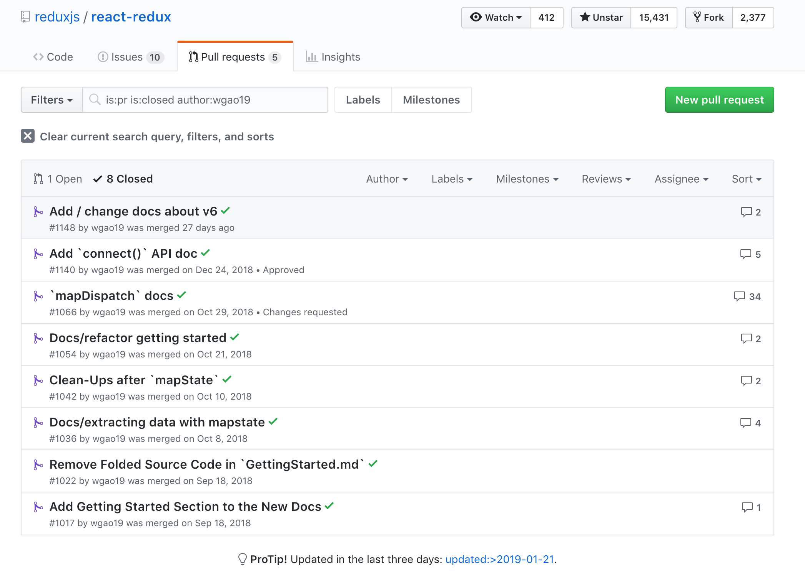

import { Split } from "mdx-deck/layouts";

# [React Redux](https://react-redux.js.org) in Four Nutshells


---

## Motivation of this talk

- Rewrite React-Redux docs completely, [#1001](https://github.com/reduxjs/react-redux/issues/1001)

```notes
last year, there was a react-redux doc rewrite issue that I've been helping with sept - nov
there is a new doc site for react-redux now
```

---



---

export default Split;

<div style={{ padding: "2rem" }}>
  
</div>

- basic tutorial
- `mapState`
- `mapDispatch`
- rework API sections
- motivation
- v6 updates

```notes
we've written ...
then one of the maintainers wrote an article about the motivation
then react v6 was released in Dec, and so we've updated the docs on that part, too
```

---

<iframe src="https://react-redux.js.org/" width="1280" height="720" />

check out [the new docsite](https://react-redux.js.org)

```notes
- docusaurus
- netlify
```

---

## What I've Learned 🤔

- 🤔 I know every little about the two libraries
- 🔮 Appreciate the design and implementation of the public APIs

```notes
i am, however, by no means an expert in this topic
on the contrary, throughout this process i've really learned how little I know about react redux

both redux and react redux are relatively small libraries
but are both core to many many apps

and by writing the doc i've learned to appreciate some of the design and implementation of the APIs
they are really really interesting and i cannot help but wanting to share with everyone
```

---

## What I've Also Learned ✌🏻

- 👍 They're constantly adapting to changes

  - React's new context API, `forwardRef`, [v6](https://github.com/reduxjs/react-redux/releases/tag/v6.0.0)
  - `hooks`, [#1063](https://github.com/reduxjs/react-redux/issues/1063)
  - Developers' requests, e.g. recent RFC _dynamic reducers_, [#1150](https://github.com/reduxjs/react-redux/issues/1150)

- ❤️ People are putting tremendous work into helping each other

```notes
and how both the libraries are constantly adapting to changes, be it the new APIs in the ecosystem, developers' requests,

context, for instance, react-redux v6 adapted to that, which we'll talk about later
hooks RFCs were published end of oct, people were excited about it
and there were a lot of interesting attempts around `useRedux`

and that people are putting tremendous work into helping each other

should have done this earlier but...
i never "feel ready" as in feel I've known enough to be able to give a talk
but i guess following the spirit of react knowledgeable
i should share the learning process because we're all constantly a work in progress
```

---

## React Redux in Four Nutshells

- 🌰 Using Redux with a UI
- 🌰 Performance Optimizations with `mapStateToProps`
- 🌰 Declarative API with `mapDispatchToProps`
- 🌰 React Redux v6

```notes
first i'd like to talk about how to use barebone redux by itself
then we'll look at the two main pieces of connect, mapState and mapDispatch
finally we'll take a look at react redux v6
```
