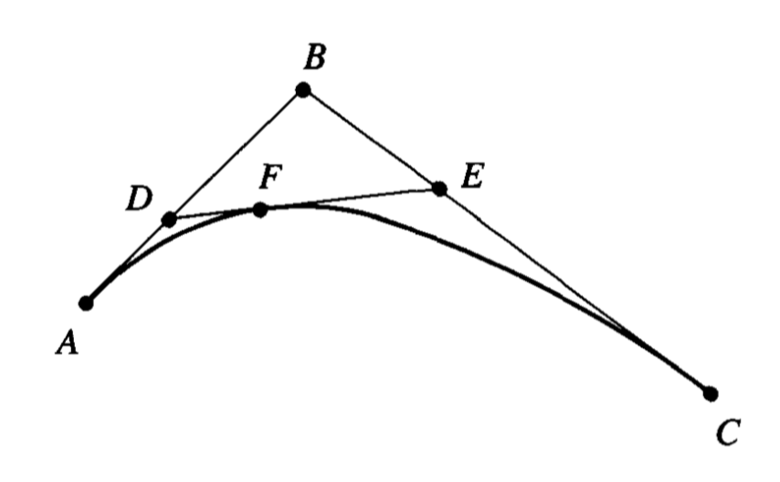
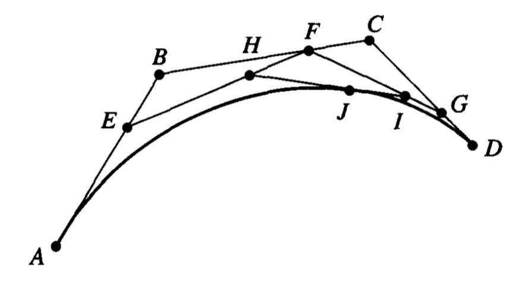
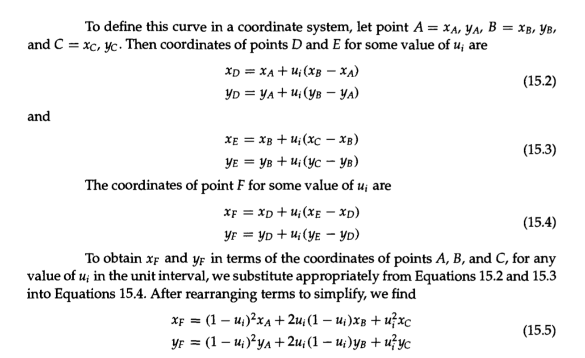

export { swiss as theme } from "mdx-deck/themes";
import { Split } from "mdx-deck/layouts";

# Understanding the Bézier Curves

An Intuitive Approach

---

## Why Bézier Curves?

[Pierre Bézier](https://en.wikipedia.org/wiki/Pierre_B%C3%A9zier), an engineer at Renault, was looking for a tool to define curves.

---


---

- easy to parametrize
- easy to alter & control shape

```notes
curves defined by the Bézier curves are
```

---



```notes
(explain the mathematical definition)
```

---


```notes
another way to visualize it is to think of it as an "interpolation"
- leaving the starting point,
- while this force drives it to move towards this direction, this other point is driving it towards this direction
- finally concluding at the end point
```

---

Recursive definition



---

Linear, quadratic, and cubic Bézier curves


---

export default Split;




---

Definitions on:

- coordinate systems
- vector spaces
- algebraic definition (with Bernstein polynomial)

Some more convenient than other depending on situations

```notes
There are very advanced mathematical theories that says they're all equivalent with each other
```

---

<iframe
  src="http://cubic-bezier.com"
  style={{ width: "100vw", height: "100vh" }}
/>

---

## Creating Animations that Look "Real"

```notes
Understanding the Bézier curves better halps you create more real-looking animations with CSS.
```
