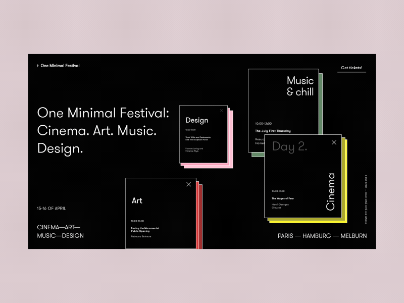
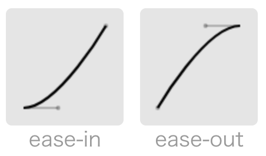
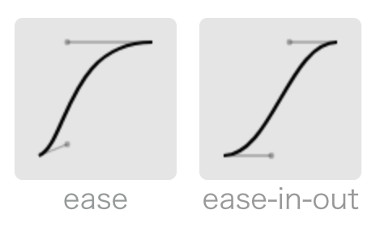

export { swiss as theme } from "mdx-deck/themes";
import { FullScreenCode } from "mdx-deck/layouts";
import { Split, Horizontal } from "mdx-deck/layouts";

# Understanding the Bézier Curves

An Intuitive Approach

---

## Why Bézier Curves?

[Pierre Bézier](https://en.wikipedia.org/wiki/Pierre_B%C3%A9zier), an engineer at Renault, was looking for a tool to define curves.

---


---

- easy to parametrize
- easy to alter & control shape

```notes
curves defined by the Bézier curves are
```

---

export default Split;


```notes
(explain the mathematical definition)
```

---


```notes
another way to visualize it is to think of it as an "interpolation"
- leaving the starting point,
- while this force drives it to move towards this direction, this other point is driving it towards this direction
- finally concluding at the end point
```

---

Linear, quadratic, and cubic Bézier curves


```notes
one of the reason why we say it is "easy to alter" is that
there is a constructive approach to add a degree to the Bézeir curves
```

---

Definitions on:

- coordinate systems
- vector spaces
- algebraic definition (with Bernstein polynomial)

Some more convenient than other depending on situations

```notes
There are very advanced mathematical theories that says they're all equivalent with each other
```

---

Some use cases of Bézier curves

  

---

## Creating Animations that Look "Real"



```notes
Understanding the Bézier curves better helps you create more real-looking animations with CSS.
```

---

trick: think about physics

<video controls autoPlay loop width="100%">
  <source src="./assets/accelerate-easing.mp4" />
</video>

---

<video controls autoPlay loop width="100%">
  <source src="./assets/decelerate-easing.mp4" />
</video>

---

quadratic curves



```css
cubic-bezier(.42, 0, 1, 1);  // ease-in
cubic-bezier(0, 0, .58, 1);  // ease-out
```

```notes
the quadratic curves are defined with three points, two of them fixed
so only one "extra point" for a source of force
```

---

cubic curves



---

```css
animation: animation 1s cubic-bezier(0.6, 0, 1, 1) infinite;
animation-direction: alternate;

@keyframes animation {
  0% {
    transform: translateY(0);
  }
  100% {
    transform: translateY(300%);
  }
}
```

[CodePen](https://codepen.io/wgao19/pen/exapzp)

---

export default FullScreenCode;

```css
animation: pausing 4s cubic-bezier(0.6, 0, 0.4, 1) infinite;

/* or ease-in-out */
animation: pausing 4s ease-in-out infinite;

@keyframes pausing {
  0%,
  20% {
    transform: translateY(0);
  }
  40%,
  50% {
    transform: translateY(1500px);
  }
  70%,
  100% {
    transform: translateY(0);
  }
}
```

```notes
we notice that it's not pausing as we wished, and we need to implement the pause
CSS animations’ looping scheme does not offer a too obvious way to implement a pause between iterations. You would have to implement the gap by combining the loops


in this case we _will_ actually need an ease-in-out timing function because
there is a change in direction
and to imlement that change in direction we need two points instead of one
```

---

bézier curves in animation time functions

"curving" the time

```notes
one thing that's really imaginative about the use of bezier curves is the css's animation timing functions

at this time you may start to realize that I "lied" to you about how we have real physics here
that's an illusion lol
we're not defining a function of distance over time as you noticed
we define relocation

then we define how much we progress with respect to time for that relocation

in another words, we "curve" the time
```

---

which Bézier curve moves the object faster?

<iframe
  src="http://cubic-bezier.com/#.6,0,1,1"
  style={{ width: "100vw", height: "80vh" }}
/>

```notes

the x axis is "our time"
the y axis is how much progress we make with respect to current time

once we understand what we're really doing with the timing functions
we can very easily tell which Bézier curve moves the object faster
```

---

### Now we should be able to implement the pausing, three-card deck


---

```css
.card-0 {
  animation: pausing 4s cubic-bezier(0.5, 0, 0.5, 1) infinite;
}
.card-1 {
  animation: pausing 4s cubic-bezier(0.5, 0.1, 0.5, 0.9) infinite;
}
.card-2 {
  animation: pausing 4s cubic-bezier(0.5, 0.4, 0.5, 0.6) infinite;
}
```

[CodePen](https://codepen.io/wgao19/pen/BvXmxQ)

```notes

```
